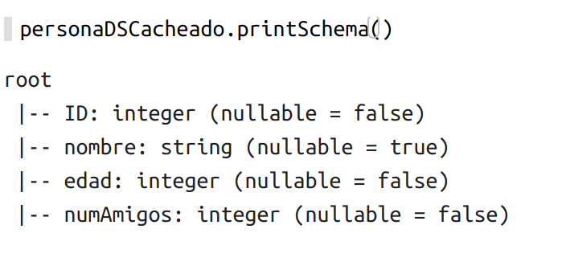
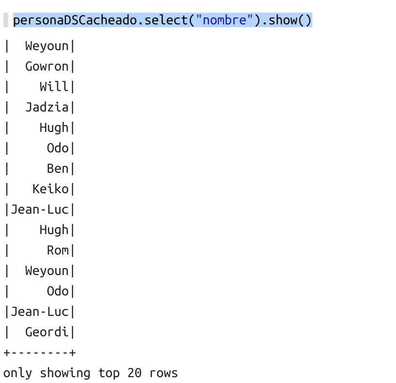
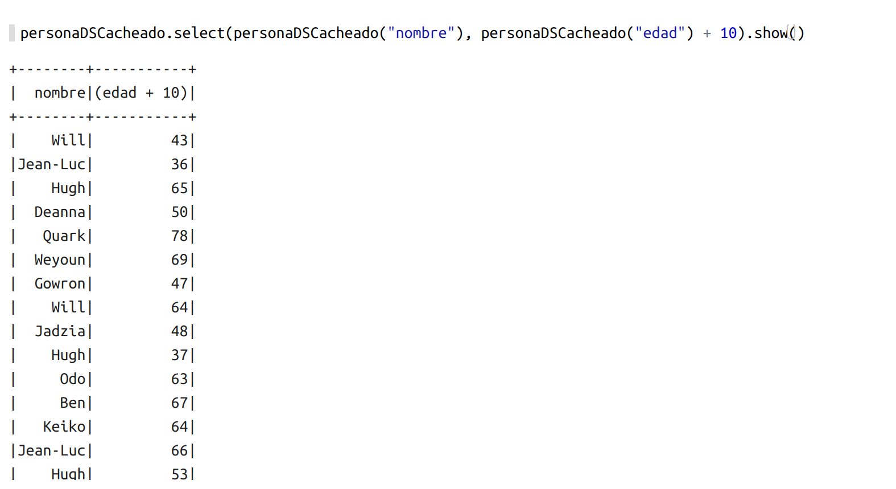
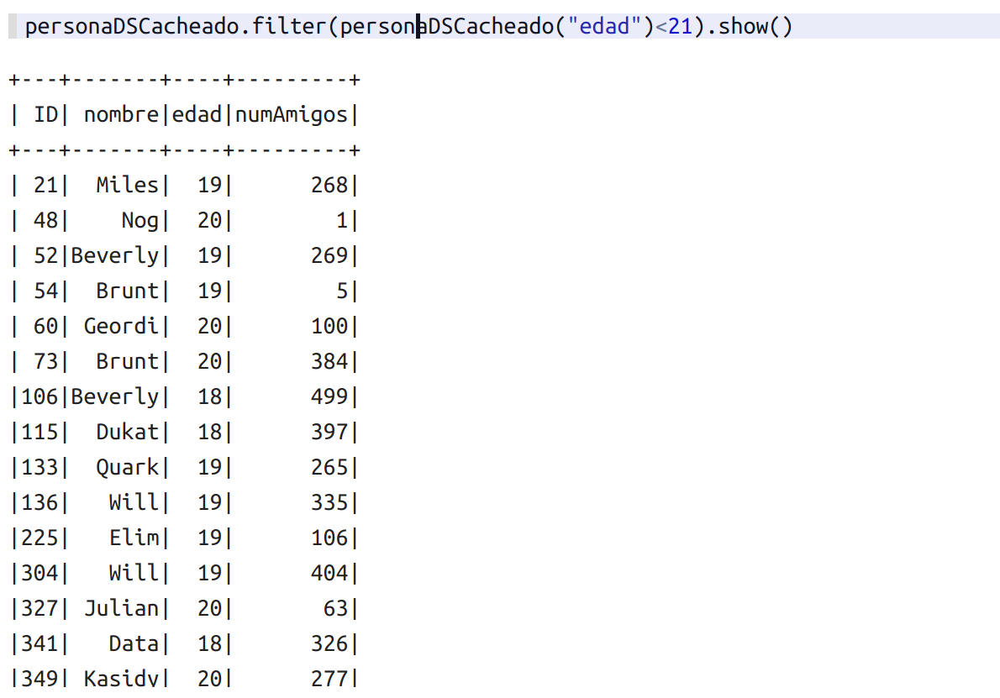
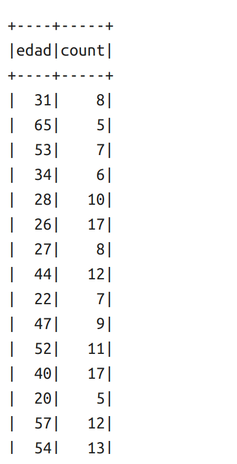

# 7 Práctica Personas API
1. [Arrancar Zeppelin ](#schema1)
2. [Importación de librerías ](#schema2)
3. [Cargar ficheros ](#schema3)
4. [Crear una clase](#schema4)
5. [Crear función para procesar personas](#schema5)
6. [Conexión con SparkSQL](#schema6)
7. [Procesar la inforamción](#schema7)
8. [Convertir el RDD a dataset cacheado](#schema8)
9. [Uso de API en lugar del SQL Litera](#schema9)
10. [Filter](#schema10)
11. [GroupBy](#schema11)

# 1. Arrancar Zeppelin
Navegamos en la consola hasta llegar donde tenemos descargados la carpeta Zeppelin y ejecutamos:
~~~
bin/zeppelin-daemon.sh start
~~~

Seguidamente abrimos un página en el navegador y vamos a `http://localhost:8080`, se nos abre zeppelin y creamos un nuevo notebook, llamado Temperatura Sensor y como intérprete elegimos `spark2`

# 2. Importación de librerías

~~~scala
import org.apache.spark._
import org.apache.spark.SparkContext._
import org.apache.spark.sql._
import spark.implicits._
~~~

# 3. Cargar ficheros

~~~scala
val lineas = spark.sparkContext.textFile("file:///home/patricia/Documentos/scala/7-personas-api/data/friends.csv")
~~~

# 4. Creamos un clase Persona

~~~scala
case class Persona(ID: Int, nombre:String,edad:Int,numAmigos: Int)
~~~

# 5. Crear función para procesar personas

~~~scala
def procesarPersona(linea:String):Persona = {
    val campos = linea.split(",")
    val persona = Persona(campos(0).toInt, campos(1),campos(2).toInt, campos(3).toInt )
    persona
}
~~~

# 6. Conexion con SparkSQL
~~~scala
val spark = SparkSession.builder.appName("SQL API").getOrCreate()
~~~

# 7. Procesar la inforamción
~~~scala
val personas = lineas.map(procesarPersona)
~~~

# 8. Convertir el RDD a dataset cacheado

Lo ponemos en cache para mantenerlo en memoria y poderlo manipular en un momento dado.
~~~scala
val personaDSCacheado = persona.toDS().cache()
personaDSCacheado.printSchema
~~~

# 9. Uso de API en lugar del SQL Litera
Con `.show()` nos muestra en pantalla los 20 en caso de haberlos.
~~~scala
personaDSCacheado.select(personaDSCacheado("nombre")).show()
~~~
~~~scala
personaDSCacheado.select($"nombre").show()
~~~
Estas dos sentencias imprimen los mismo, al poner el símbolo `$`delante del campo a imprimir es lo mismo que si nombramos el dataset. 

Hay que separa con comas dentro del `select` para obtener más de un campo.
~~~scala
personaDSCacheado.select(personaDSCacheado("nombre"), personaDSCacheado("edad") + 10).show()
~~~

# 10. Filter

~~~scala
personaDSCacheado.filter(personaDSCacheado("edad")<21).show()
~~~

# 11. GroupBy
~~~scala
personaDSCacheado.groupBy("edad").count().show()
~~~
